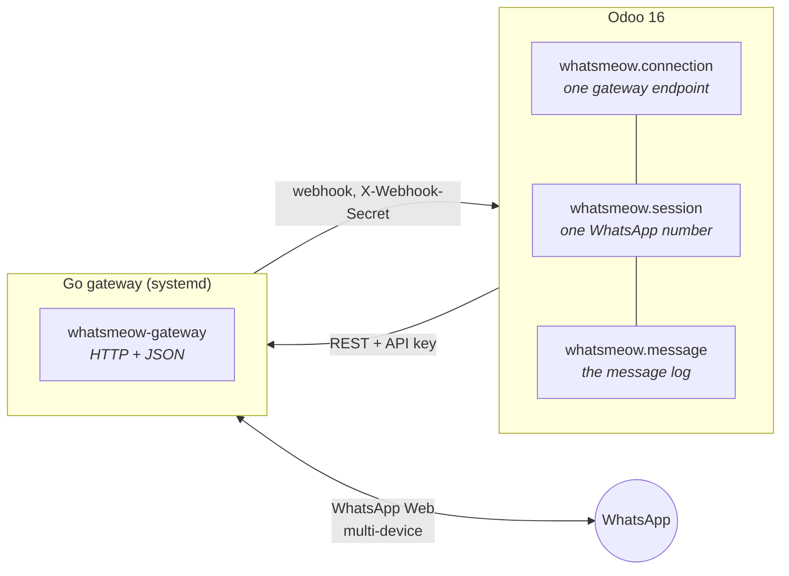

# WhatsApp for Odoo 16 — whatsmeow connector

[](LICENSE)
[](https://github.com/odoo/odoo/tree/16.0)
[](https://go.dev)

Send and receive WhatsApp messages from Odoo through a self-hosted gateway — no
Meta Business account, no per-message fees, no template approval. An Odoo module
suite talks to a small Go service that speaks the WhatsApp Web multi-device
protocol via [whatsmeow](https://github.com/tulir/whatsmeow).

You pair a real WhatsApp number by scanning a QR code, exactly as you would with
WhatsApp Web. Messages land in Odoo as records, post to the contact's chatter, or
open a live conversation in Discuss.

---

## ⚠️ Read this before you deploy

This uses the **unofficial** WhatsApp Web protocol. It is not affiliated with,
endorsed by, or supported by WhatsApp or Meta.

- **Your number can be banned.** WhatsApp actively detects and bans automated and
  bulk senders. A ban is usually permanent and can take the number's account with it.
- **Use a number you can afford to lose.** Never pair your primary business line
  without accepting that risk.
- **Automated messaging likely violates WhatsApp's Terms of Service.** Whether that
  matters to you is your call and your liability, not this project's.
- If you need a supported, contractual channel, use the
  [WhatsApp Cloud API](https://developers.facebook.com/docs/whatsapp) instead.

The project takes this seriously — see [Protecting the number](#protecting-the-number)
for the mitigations built in. They reduce risk. They do not eliminate it.

---

## Architecture

One Odoo can drive several gateways; one gateway can hold several WhatsApp numbers.



Outbound goes Odoo → gateway over REST, authenticated with an API key. Inbound
arrives at `/whatsmeow/webhook`, routed to the right connection by the
`X-Webhook-Secret` header.

## Modules

| Module | What it adds | Required |
|---|---|---|
| `whatsmeow` | Connections, sessions, the message log, media, inbound filtering, opt-out and volume caps. Posts inbound to the partner's chatter. | Yes |
| `whatsmeow_discuss` | Attend WhatsApp conversations in Odoo Discuss — one channel per chat, operator replies, rule-based routing, two-way reactions. | Optional |
| `whatsmeow_template` | Saved, field-interpolated message bodies (`{{ object.name }}`), attachments and generated PDF reports, a chatter *Send WhatsApp* button and a *Send WhatsApp* server action. | Optional |

Both bridges are opt-in and change nothing until installed.

## Features

**Messaging** — text and media in both directions: image, video, audio (including
voice notes), document, sticker. Delivery states (sent → delivered → read), replies
to private chats and groups, and LID-only contacts (senders with no visible phone
number).

**Inbound filtering** — each session accepts or rejects incoming messages by rule,
first-match-wins: by chat, contact, phone, LID, chat type, message type, keyword or
whether the sender is new. A rejected message is never stored.

**Discuss routing** *(bridge)* — an accepted message opens or continues a
`mail.channel`; operators reply by typing in the thread. Routing rules pick who
attends. Reactions sync both ways.

**Templates** *(bridge)* — send from any record via the chatter button, the Action
menu, or automation. Sends reuse the core queue, so pacing, retries and idempotency
come for free.

**Reliability** — the webhook is idempotent (a partial unique index, not
search-then-create); sends carry an idempotency key derived from the committed
record id, so a rollback after the gateway POST can't double-send; WhatsApp's
duplicate-with-empty-body quirk is merged so the real copy wins.

## Requirements

| | |
|---|---|
| Odoo | 16.0 |
| Python | 3.8+ (Odoo 16's minimum), with `qrcode` and `requests` |
| Gateway host | Debian 12/13 or Ubuntu 22.04/24.04 (systemd + apt), root access |
| Go | 1.26+ — the installer provisions it if missing |
| Build | a C compiler; `go-sqlite3` needs CGO |

## Install

### 1. The gateway

Copy or clone the repository onto the gateway host and run the installer from the
repository root:

```bash
sudo ./install.sh
```

It installs build dependencies and the Go toolchain if needed, creates the `wagw`
system user and data directory, builds the binary into `/opt/whatsmeow-gateway`,
generates `gateway.env` with fresh secrets, starts the systemd unit, waits for
`/health`, then prints the API key and webhook secret to paste into Odoo.

Re-running is safe — it keeps your secrets and data, rebuilds and restarts. That is
how you deploy a new version. Full details, knobs and troubleshooting are in
[DEPLOY.md](DEPLOY.md).

The gateway listens on `127.0.0.1` only. Put Odoo on the same host, or front it with
TLS and firewall it — the API key is the only thing between the internet and your
WhatsApp account.

### 2. The Odoo modules

Add `addons/` to your Odoo `addons_path`, then:

```bash
odoo-bin -c odoo.conf -d <database> -i whatsmeow --stop-after-init
# optional bridges
odoo-bin -c odoo.conf -d <database> -i whatsmeow_discuss,whatsmeow_template --stop-after-init
```

### 3. Pair a number

1. **WhatsApp → Configuration → Gateways** — create one, paste the gateway URL,
   API key and webhook secret, hit **Test Connection**.
2. **WhatsApp → Configuration → Sessions** — create one, give it a code, **Start**.
3. Scan the QR with the phone (WhatsApp → *Linked devices* → *Link a device*).

The session goes `Connected` and inbound messages start arriving.

## Configuration

The gateway reads `/opt/whatsmeow-gateway/gateway.env`. Defaults are sensible;
`gateway/gateway.env.example` documents every knob and *why* it exists.

| Variable | Default | Purpose |
|---|---|---|
| `WMG_LISTEN` | `127.0.0.1:8080` | Listen address |
| `WMG_API_KEY` | *(generated)* | Bearer key Odoo must present |
| `WMG_WEBHOOK_SECRET` | *(generated)* | Sent as `X-Webhook-Secret`; routes to the connection |
| `WMG_ODOO_WEBHOOK_URL` | `http://127.0.0.1:8069/whatsmeow/webhook` | Where events go |
| `WMG_DATA_DIR` | `/var/lib/whatsmeow-gateway` | Session stores and staged media |
| `WMG_MAX_MEDIA_MB` | `100` | Largest media accepted, either direction |
| `WMG_MEDIA_TTL_HOURS` | `24` | Before uncollected media is GC'd |
| `WMG_CHECK_PER_HOUR` | `500` | Uncached number lookups per session per hour |
| `WMG_WEBHOOK_WORKERS` | `4` | Concurrent webhook posts — a safety limit, not a throughput dial |

Two pairs must be kept in sync across the language boundary, and both are commented
at each site: `WMG_CHECK_TTL_DAYS` ↔ `REGISTRATION_TTL_DAYS`, and
`WMG_CHECK_MAX_BATCH` ≥ `CHECK_BATCH_SIZE`.

## Protecting the number

Ban avoidance is a first-class concern here, not an afterthought.

- **Opt-out is absolute.** `res.partner.whatsmeow_optout` blocks every send path.
  Contacts can opt out by keyword — the wording is per-client data, matched by the
  same rule engine as inbound filtering.
- **Recipient validation.** Numbers are checked against WhatsApp before sending, so
  messages don't go into the void. Answers are cached and lookups rationed, because
  bulk-querying is itself a bulk-sender fingerprint. An unanswered number is never
  treated as a "no".
- **Volume caps with a warm-up curve.** The queue is capped per session per day, on
  a `base × growth ^ days_online` curve — a new number starts quiet and earns
  volume. Operator replies to someone who wrote first are uncapped, being the safest
  traffic there is.
- **Never fan out.** One group reply produces a receipt per participant; the gateway
  queues events and posts them with a bounded worker pool rather than a goroutine
  each.

Quiet hours, a circuit breaker on delivery ratio, and per-contact frequency caps are
on the roadmap.

## Development

```bash
# Odoo module tests
odoo-bin -c odoo.conf -d <db> -u whatsmeow --test-enable \
  --test-tags /whatsmeow --stop-after-init --http-port=8099

# Gateway tests — run the concurrency ones with -race, they are about races
cd gateway && go test ./... && go test -race ./...
```

The whatsmeow version is **pinned** in `gateway/go.mod`. That is deliberate:
whatsmeow has no stable releases and its API drifts, so an unattended upgrade is how
a working gateway silently stops compiling. To move the pin on purpose:

```bash
sudo UPGRADE_WHATSMEOW=1 ./install.sh   # then commit go.mod and go.sum
```

## Gateway API

All routes except `/health` require `Authorization: Bearer $WMG_API_KEY`.

| Method | Route | |
|---|---|---|
| `GET` | `/health` | Liveness |
| `GET` | `/sessions` | List sessions and states |
| `POST` | `/sessions/{name}/start` | Start / pair |
| `GET` | `/sessions/{name}/qr` | Pairing QR |
| `GET` | `/sessions/{name}/status` | Connection state |
| `POST` | `/sessions/{name}/logout` | Unlink the device |
| `POST` | `/sessions/{name}/send` | Send text |
| `POST` | `/sessions/{name}/send-media` | Send media |
| `POST` | `/sessions/{name}/react` | React to a message |
| `POST` | `/sessions/{name}/read` | Mark read |
| `POST` | `/sessions/{name}/check` | Are these numbers on WhatsApp? |
| `GET`/`DELETE` | `/sessions/{name}/media/{id}` | Fetch / release staged inbound media |

## License

[LGPL-3.0](LICENSE), matching Odoo Community. The gateway links
[whatsmeow](https://github.com/tulir/whatsmeow) (MPL-2.0), which is compatible;
whatsmeow's own files remain under its license.

## Credits

Built by **Fasil** ([@fasilwdr](https://github.com/fasilwdr)) on top of
[whatsmeow](https://github.com/tulir/whatsmeow) by Tulir Asokan.

Not affiliated with WhatsApp or Meta. "WhatsApp" is a trademark of Meta Platforms, Inc.
